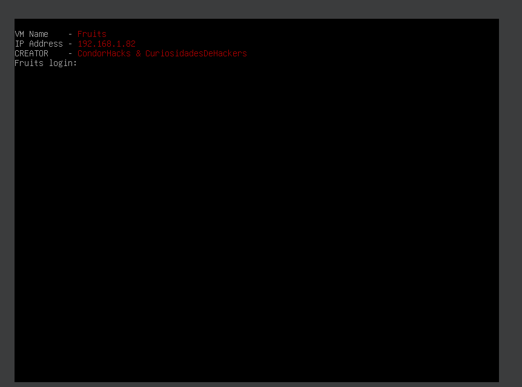
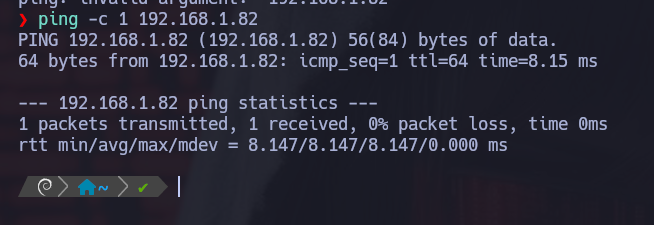
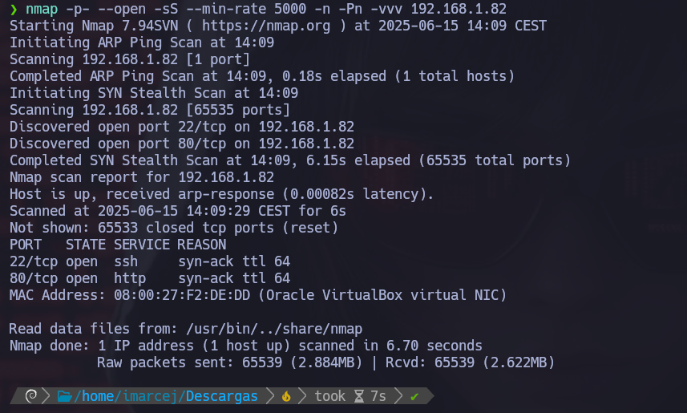
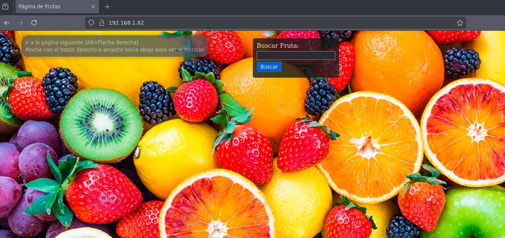
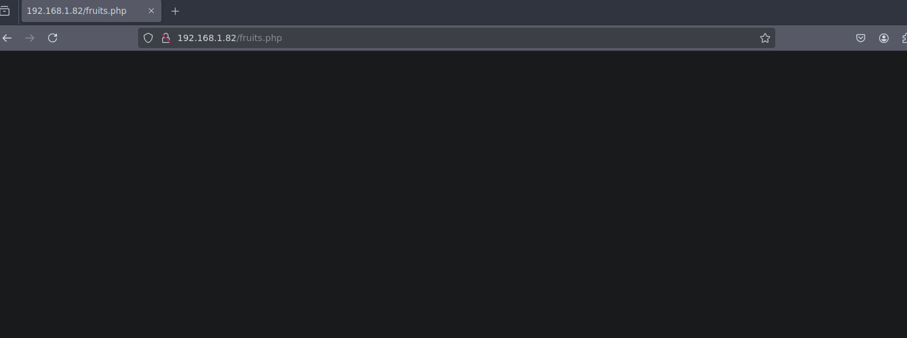
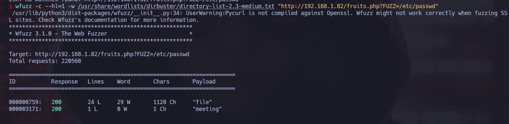
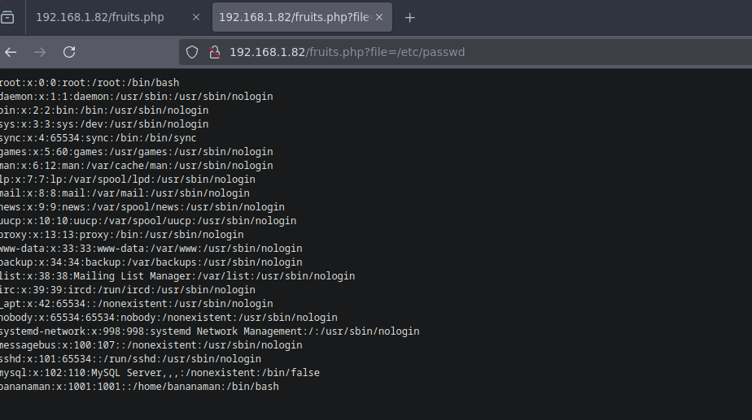
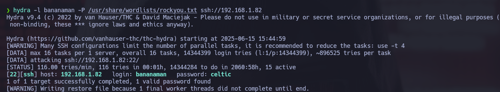
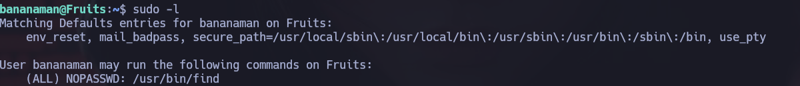
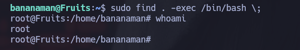

# 🧠 MÁQUINA FRUITS

**Dificultad:** 🟢 Fácil.

---

## 1.  Encendemos la máquina vulnerable



---

## 2. Verificación de conectividad en la red:



---

## 3. Reconocimiento con **NMAP**



Explicación detallada de cada parámetro:

- **-p-**: Hace un escaneo de todos los puertos (1-65535).
- **--open**: Muestra solo puertos abiertos.
- **-sS**: Nos permite hacer escaneos sigilosos y evitar la detección de firewall. Hace un escaneo de tipo SYN sin establecer conexión completa, y así evitar la detección del firewall.
- **--min-rate=5000**: Este parámetro nos ayuda a controlar la velocidad de los paquetes enviados y así poder hacer un escaneo más rápido con 5000 paquetes por segundo.
- **-Pn**: No realiza ping porque ya da por hecho que el host está activo.
- **-n**: No hace resolución DNS.
- **-vvv**: Modo verbose, para ir viendo información detallada en tiempo real.

Ahora que hemos visto, que el puerto 22 y 80 están abiertos, abrimos el navegador:

```bash
http://192.168.1.2:80
```

---

## 4. Análisis web y descubrimiento de vulnerabilidades



Inicialmente la página no muestra contenido relevante. Tras inspeccionar el código HTML, no encontramos pistas útiles.

---

Uso de Gobuster para encontrar rutas ocultas


Gobuster nos revela la existencia de un archivo llamado fruits.php. Lo abrimos en el navegador:



De primeras, al explorar la aplicación web manualmente, no se observa ningún comportamiento evidente que nos permita interactuar con funcionalidades sensibles. Por ello, decidimos utilizar la herramienta wfuzz para realizar una búsqueda mediante fuerza bruta (fuzzing) de posibles parámetros que la aplicación acepte por GET y que puedan estar ocultos.



Este comando sustituye FUZZ por cada palabra del diccionario, intentando detectar si alguno de esos nombres es un parámetro válido que esté siendo procesado por el servidor. Además, leemos el archivo /etc/passwd como prueba de concepto para detectar una posible vulnerabilidad de inclusión de archivos locales (LFI).

Gracias a esta técnica descubrimos que la aplicación acepta un parámetro llamado file, lo que nos permitió acceder al contenido de archivos del sistema como:

```bash
http://192.168.1.82/fruits.php?file=/etc/passwd
```

Este hallazgo confirma la existencia de una vulnerabilidad LFI, lo que representa una potencial vía de escalada o extracción de información sensible del sistema.



También encontramos algo interesante: entre los resultados del archivo /etc/passwd aparece un usuario llamado bananaman. Este descubrimiento es relevante, ya que se trata de un usuario válido del sistema y podría representar una vía potencial para realizar un ataque de fuerza bruta por SSH utilizando herramientas como Hydra.

## 5. Explotación de vulnerabilidades:



**Hydra** nos ha detectado la contraseña del usuario **bananaman**, ahora lo utilizaremos como vía para entrar por SSH.

Gracias a Hydra, logramos descubrir la contraseña del usuario bananaman mediante un ataque de fuerza bruta. Utilizaremos estas credenciales para acceder al sistema a través del servicio SSH, lo que nos permitirá obtener una sesión interactiva como dicho usuario.

Una vez dentro del sistema como el usuario bananaman, el siguiente paso es verificar qué comandos puede ejecutar con privilegios elevados. Para ello, utilizamos el siguiente comando:



## 6. Escalada de privilegios

Tras verificar los permisos de sudo disponibles para el usuario bananaman, observamos que tiene permiso para ejecutar el binario find como root sin necesidad de contraseña. Este tipo de configuración permite aprovechar una técnica conocida para escalar privilegios.

Ejecutamos el siguiente comando para obtener una shell con permisos de root:

```bash
sudo find . -exec /bin/bash \;
```

Este comando hace uso del parámetro -exec de find para invocar una shell (/bin/bash) como superusuario. Al ejecutarse correctamente, obtenemos una shell interactiva con privilegios de root.



Con esto, se completa exitosamente la resolución de la máquina.

---

📅 Resuelta el 15/06/25

👩Por Marcela Jiménez (aka Mar) 🐉


