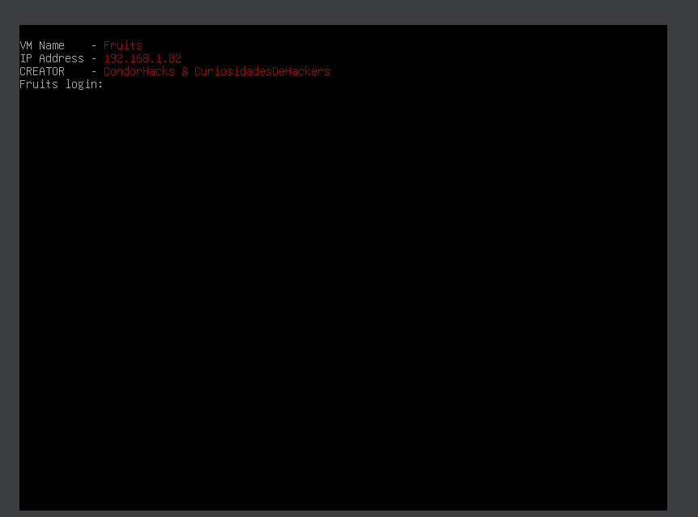
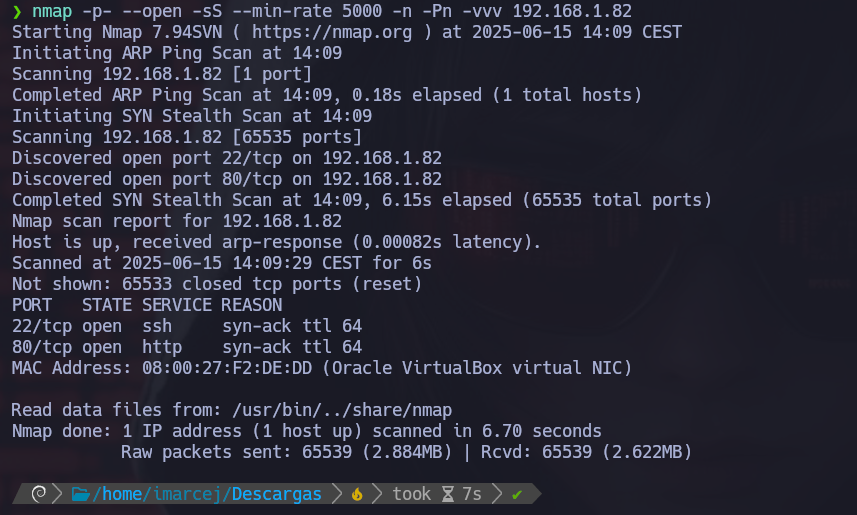
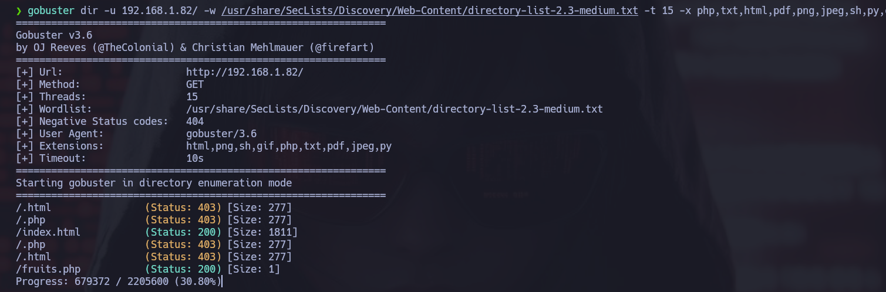

# 🧠 MÁQUINA FRUITS

**Dificultad:** 🟢 Fácil.

---

## 1.  Encendemos la máquina vulnerable



---

## 2. Verificación de conectividad en la red:


---

## 3. Reconocimiento con **NMAP**



Explicación detallada de cada parámetro:

- **-p-**: Hace un escaneo de todos los puertos (1-65535).
- **--open**: Muestra solo puertos abiertos.
- **-sS**: Nos permite hacer escaneos sigilosos y evitar la detección de firewall. Hace un escaneo de tipo SYN sin establecer conexión completa, y así evitar la detección del firewall.
- **--min-rate=5000**: Este parámetro nos ayuda a controlar la velocidad de los paquetes enviados y así poder hacer un escaneo más rápido con 5000 paquetes por segundo.
- **-Pn**: No realiza ping porque ya da por hecho que el host está activo.
- **-n**: No hace resolución DNS.
- **-vvv**: Modo verbose, para ir viendo información detallada en tiempo real.

Ahora que hemos visto, que el puerto 22 y 80 están abiertos, abrimos el navegador:

```bash
http://192.168.1.2:80
```

---

## 4. Búsqueda de vulnerabilidades:


De primeras nos encontramos esta página, he inspeccionado la página y no hay nada interesante que nos pueda dar alguna pista...

---

Ahora utilizaré **gobuster** para ver si nos ayuda a identificar archivos o directorios ocultos:



Y nos ha detectado **fruits.php** vamos a escribirlo en el navegador para ver si nos da una pista:


De primeras, al explorar la aplicación web manualmente, no se observa ningún comportamiento evidente que nos permita interactuar con funcionalidades sensibles. Por ello, decidimos utilizar la herramienta wfuzz para realizar una búsqueda mediante fuerza bruta (fuzzing) de posibles parámetros que la aplicación acepte por GET y que puedan estar ocultos.


Este comando sustituye FUZZ por cada palabra del diccionario, intentando detectar si alguno de esos nombres es un parámetro válido que esté siendo procesado por el servidor. Además, leemos el archivo /etc/passwd como prueba de concepto para detectar una posible vulnerabilidad de inclusión de archivos locales (LFI).

Gracias a esta técnica descubrimos que la aplicación acepta un parámetro llamado file, lo que nos permitió acceder al contenido de archivos del sistema como:

```bash
http://192.168.1.82/fruits.php?file=/etc/passwd
```

Este hallazgo confirma la existencia de una vulnerabilidad LFI, lo que representa una potencial vía de escalada o extracción de información sensible del sistema.


